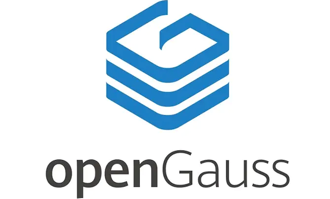

+++

title = "openGauss数据库之SQL介绍"

date = "2020-09-08"

tags = ["SQL", "openGauss"]

archives = "2022-09"

author = "liwt"

summary = "结构化查询语言（SQL）是用于访问和处理关系型数据库的标准计算机语言。openGauss数据库支持的SQL标准，默认支持SQL2、SQL3和SQL4的主要特性。"

+++

 **一、什么是SQL？** 

 **1、SQL的概念** 

结构化查询语言（SQL）是用于访问和处理关系型数据库的标准计算机语言。

SQL提供了各种任务的语句，包括：

•	查询数据。

•	在表中插入，更新和删除行。

•	创建，替换，更改和删除对象。

•	控制对数据库及其对象的访问。

•	保证数据库的一致性和完整性。

SQL语言由用于处理数据库和数据库对象的命令和函数组成：

•	DDL（data definition language）数据定义语言，用户定义和管理sql数据库中所有对象的语言。 主要命令：create、alter、drop等

•	DML（data manipulation language）数据操作语言。 主要命令：select、update、insert、delete等

•	DCL（date control language）数据库控制功能。主要命令：grant、deny、revoke、commit、savepoint、rollback等

 **2、SQL的特点** 

•	SQL语言集数据查询、数据操纵、数据定义和数据控制功能于一体

•	面向集合的语言

•	非过程语言

•	类似自然语言，简洁易用

•	自含式语言，又是嵌入式语言。可独立使用，也可嵌入到宿主语言中。

 **3、SQL发展简史** 

1986年，ANSI X3.135-1986，ISO/IEC 9075:1986，SQL-86

1989年，ANSI X3.135-1989，ISO/IEC 9075:1989，SQL-89

1992年，ANSI X3.135-1992，ISO/IEC 9075:1992，SQL-92（SQL2）

1999年，ISO/IEC 9075:1999，SQL:1999（SQL3）

2003年，ISO/IEC 9075:2003，SQL:2003（SQL4）

2011年，ISO/IEC 9075:200N，SQL:2011（SQL5）

//注：

ANSI是美国国家标准学会（American National Standards Institute）的英文简称，成立于1918年。

ISO:国际标准化组织(International Organization for Standardization)。

IEC:国际电工委员会(International Electrotechnical Commission）。

//

 **4、openGauss数据库的“SQL”** 

openGauss数据库支持的SQL标准，默认支持SQL2、SQL3和SQL4的主要特性。

