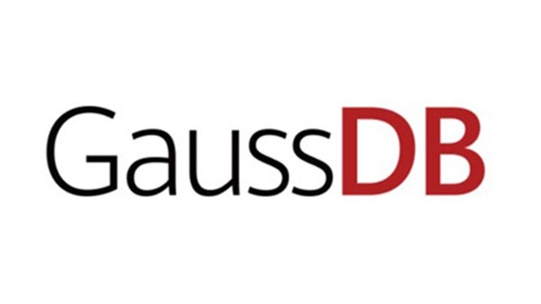

+++

title = "GaussDB数据库参数调优建议"

date = "2024-02-28"

tags = ["openGauss"]

archives = "2024-02"

author = "liwt"

summary = "GaussDB数据库参数调优建议"

+++

参数调优建议

数据库参数是数据库系统运行的关键配置信息，设置不合适的参数值可能会影响业务。本文列举了一些重要参数说明，更多参数详细说明，请参考导出参数，将参数导出后查看。

通过控制台界面修改参数值。

一、查询

1、track_stmt_session_slot

1）作用：设置一个session缓存的最大的全量/慢SQL的数量。

2）影响：缓存的SQL定期会被写入到系统表，如果业务量很大，超过这个数量语句执行将不会被跟踪，直到落盘线程将缓存语句落盘，留出空闲的空间，但不影响SQL的执行。

2、effective_cache_size

1）作用：设置节点优化器在一次单一的查询中可用的磁盘缓冲区的有效大小。设置这个参数，还要考虑的共享缓冲区以及内核的磁盘缓冲区。另外，还要考虑预计的在不同表之间的并发查询数目，因为它们将共享可用的空间。这个参数对分配的共享内存大小没有影响，它也不会使用内核磁盘缓冲，它只用于估算。数值是用磁盘页来计算的，通常每个页面是8192字节。

2）取值范围：整型，1～INT_MAX，单位为8KB。

3）影响：比默认值高的数值可能会导致使用索引扫描，更低的数值可能会导致选择顺序扫描。

3、enable_stream_operator

控制优化器对stream的使用。当该参数关闭时，可能会有大量关于计划不能下推的日志记录到日志文件中。

4、log_min_duration_statement

1）作用：当某条语句的持续时间大于或者等于特定的毫秒数时，记录每条完成语句的持续时间。设置log_min_duration_statement可以很方便地跟踪需要优化的查询语句。对于使用扩展查询协议的客户端，语法分析、绑定、执行每一步所花时间被独立记录。

2）影响：设置过低的阈值可能影响负载吞吐，-1表示关闭此功能。

二、审计参数

audit_system_object

1）作用：该参数决定是否对数据库对象的CREATE、DROP、ALTER操作进行审计。数据库对象包括DATABASE、USER、SCHEMA、TABLE等。通过修改该配置参数的值，可以只审计需要的数据库对象的操作,在主备强制选主场景建议。

2）影响：不当修改该参数会导致丢失DDL审计日志，请在客服人员指导下进行修改。

三、锁管理

update_lockwait_timeout

设置并发更新同一行数据时单个锁的最长等待时间，当申请的锁等待时间超过设定值时系统会报错。0表示不会超时，默认值为2min。

四、连接与认证

1、session_timeout

表明与服务器建立连接后，不进行任何操作一定时间后超时的限制，0表示关闭超时设置。

2、failed_login_attempts

设置密码错误次数上限，输入密码错误的次数达到该参数所设置的值时，账户将会被自动锁定，配置为0时表示不限制密码输入错误的次数。

3、password_effect_time

设置帐户密码的有效时间，0表示不开启有效期限制功能。

4、password_lock_time

设置账户被锁定后的自动解锁时间，单位为天。

