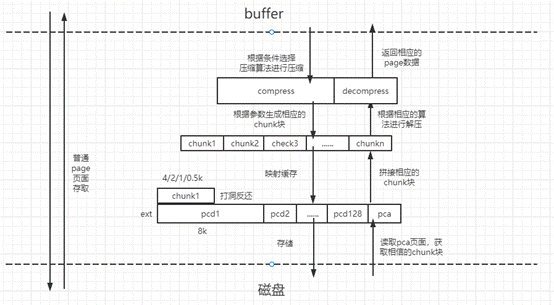
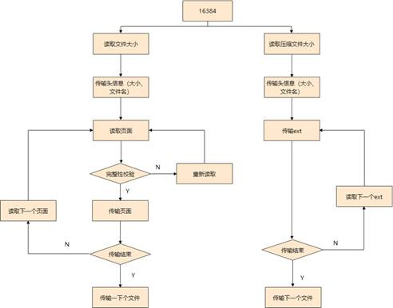

+++

title = "openGauss的高效数据压缩算法"

date = "2022-11-15"

tags = ["高效数据压缩算法"]

archives = "2022-11"

author = "王天庆"

summary = "高效数据压缩算法"

times = "12:30"

+++

# openGauss的高效数据压缩算法

## 1. 实现背景

1.  背景

    随着大数据、云计算、物联网的急速发展，数据量呈指数级增长，因此需要消耗更多的存储空间。客户对数据库性能和资源的消耗也愈发看中，期望通过算法优化和软件优化尽可能的对有限的硬件资源进行充分且高效的利用。其中数据的存储资源利用率首当其冲成为行业关注的目标。高效数据压缩算法作为对数据库存储的优化，期望将数据通过压缩存储，在相同的硬件资源下可以更多的存储处理数据，有效的提升数据库对磁盘的利用。

2.  现有技术

    目前主流的数据库厂家（MySQL、Oracle、Postgresql、SQL Server等）都有自己特有的压缩方案，在此基础上openGauss将进一步探索压缩比更高的算法方案。

    MySQL的透明压缩，利用文件系统的打洞技术（文件系统特性，打洞单位是4K），单个page的所有数据在落盘前，先交给zlib或者lz4、zstd等通用压缩算法进行压缩，再将压缩后的数据存储到原始地址，后面节省出来的空间就可以进行打洞处理。优点就是实现方便。缺点是在Linux上打洞单位是4K，且page大小为32K和64K时候不支持压缩，最大是16K的page支持这种压缩，因此，压缩比最大能到4：1，这个是压缩极限了。

    Oracle的字典压缩，在块级别（page概念）创建行字段的字典，字段存储字典元素的引用。发生更新，插入，删除操作的时候，通过一个阈值控制是否进行压缩。他压缩算法在理解上是基于存储块的字典压缩算法，在页面内维护一块符号表，所有操作都基于此符号表做变换及逆变换，实现复杂。优点在于不依赖于文件系统。缺点是字典压缩很容易受到数据本身特征的影响，如果是重复度不高的数据，压缩率就很低。

## 2. openGauss高效数据压缩算法

-   2.1 主要创新技术点

    openGauss的主要创新技术点总结如下：

    （一）改进压缩算法，压缩数据单位依然是选择页级别，进一步结合Page结构以及本身数据的特征，将page交给通用压缩算法前，先将Page按照字节级别进行有序转换、或者是多页联合重组、或者是差分预处理，这样能获得更高的压缩率，且这一步预处理几乎不会带来多大的性能损耗。

    （二）压缩存储块管理，单个页面压缩后的压缩块以chunk为粒度进行存储，然后将存储结果和页面的映射关系进行管理，因此相对于压缩页面需要在内存和磁盘之间加一层映射关系管理，记录页面压缩块与chunk存储单元之前的关系，我们称之为压缩页面地址管理（pca），对应的将记录压缩块chunk的页面称为压缩页面数据管理（pcd）。非压缩页面的页面号与存储资源block是一一对应的，不需要单独管理。Pca中不但要记录每个页面的压缩块使用了哪些chunk资源块，而且记录了chunk资源块的排列顺序，在页面访问时都先通过查询地址管理页面才能找到压缩块的存储位置。由于使用了更小的chunk，将每个页面节省的空间累积在一起，通过打洞方式返还给操作系统。

-   2.2      功能实现

    在page页面落盘之前，根据条件\(是否多页联动、差分预处理等\)选择相应压缩算法，对单页面page进行压缩，压缩后至少需要一个chunk来存储，以page大小8K为例，选择4K，2K，1K，0.5K的压缩后理论上限分别为50%、25%、12.5%，6.25%。同时chunk的个数也决定了每个页面压缩后的大小不是连续变化的，而是以chunk大小阶跃变化。同时以一个ext单元的形式进行存储，一个ext单元由128个pcd数据页面和1个pca映射页面组成。Pcd数据页面预划分为8k，即使不进行压缩，存储单元也足够存储。将压缩后的chunk块存储在每个pcd页面，将剩余的空间进行打洞反还给操作系统。将映射消息记录在pca页面，为pca页面建立pcabuffer缓存，方便快速访问。

    

    落盘过程原理图

## 3. 压缩方案应用场景

1.在线生产环境OLTP，减少实时数据对磁盘空间占用。

2.数据库文件压缩备份存储，减少备份数据磁盘空间占用。

3.主备物流文件复制的场景，减少传输过程的网络带宽。

下面以开源备份工具gs\_basebackup兼容压缩表数据备份示例：

basebackup备份流程图

openGauss适配改进的压缩算法，在不影响数据库性能的前提下对数据进行压缩和存储，可达到存储大小整体下降20%的最终目标。

上述内容是openGauss在3.1.0版本上实现的数据高效压缩功能。未来，openGauss还会在数据库的存储领域持续研发，打造顶尖的数据库存储方案，做到行业领先。

