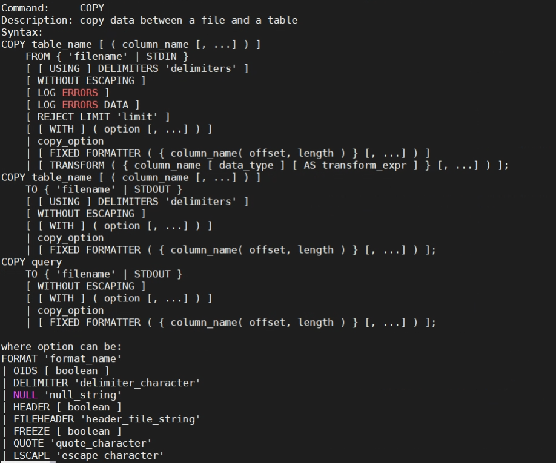
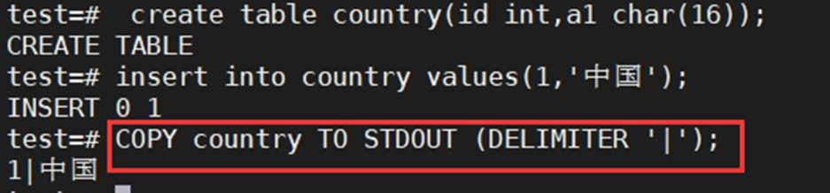
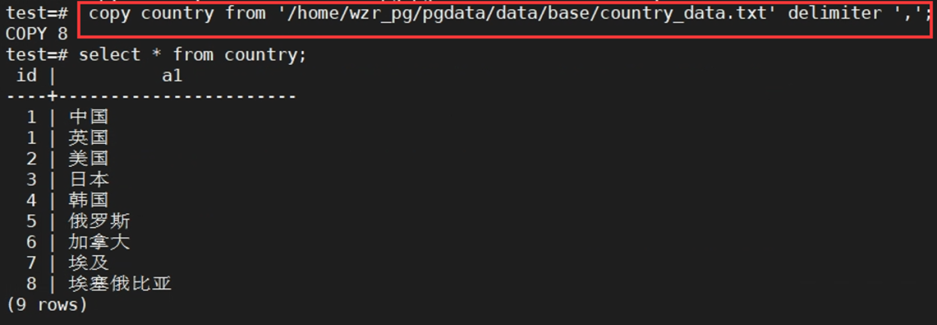
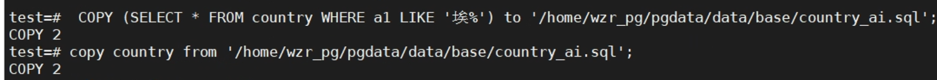
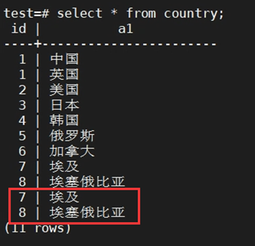
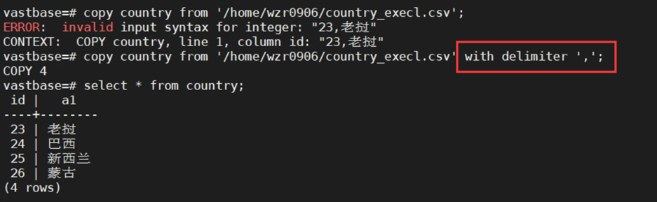
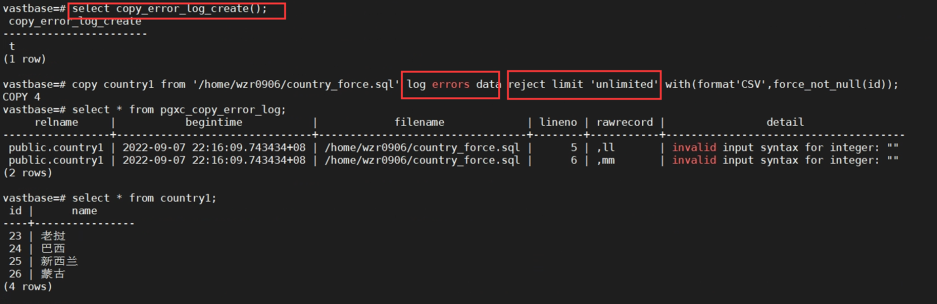
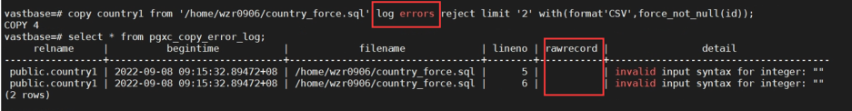

+++  
title="openGauss社区入门(opengauss-导入导出（copy）)"  
date="2022-09-23"  
tags=["openGauss社区开发入门"]   
archives="2022-09"  
author="wangrururu"  
summary="openGauss社区开发入门"  
img="/zh/post/wzr/title/title.jpg"  
times="12：08"  
+++  

COPY  命令可以使表和文件之间交换数据，有两种用法：

- COPY TO：把一个表的所有内容都拷贝到一个文件，还可拷贝select查询的结果
- COPY FROM:从一个文件里拷贝数据到一个表里

其语法格式为：

用法如下：  
1.将一个表拷贝到客户端，使用竖线(|)作为域分隔符：

2.从.txt文件中拷贝数据到country表

3.把‘埃’开头的国家名拷贝到一个sql文件里；再将此sql文件导入到表country中。 
 

4.将execl表中数据导入到country表中：  
（1）将excel表格字段按照数据库中表的字段顺序整理数据，并保存为csv文件。  
（2）用记事本打开csv文件，另存为UTF-8格式。  
（3）给用户execl表的读写权限。  

5.Log errors：  
（1）创建日志select copy_error_log_create();  
（2）使用。

