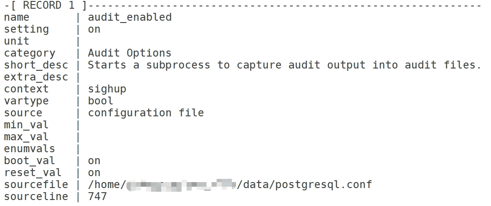
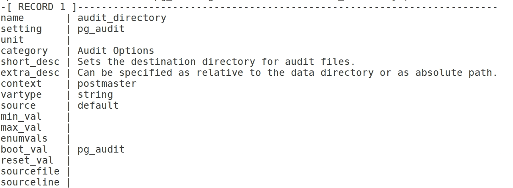
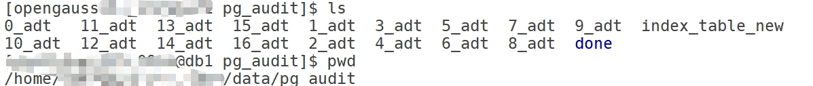
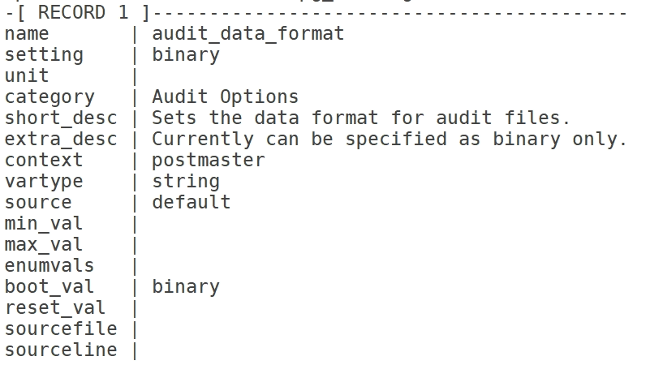
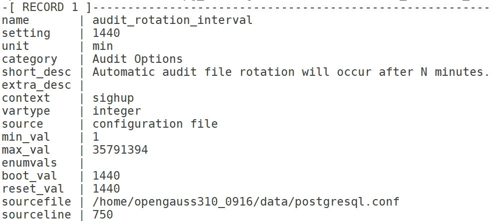
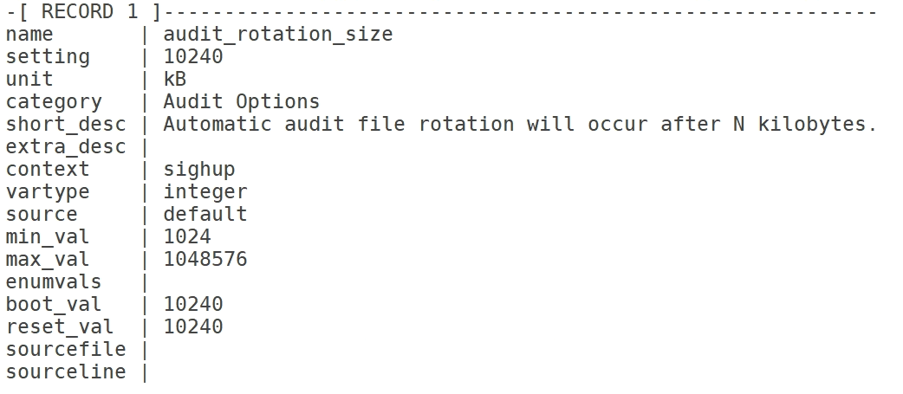
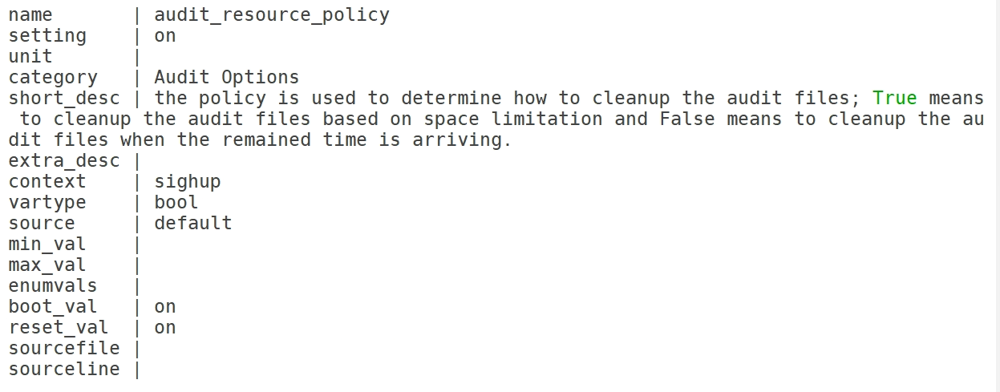
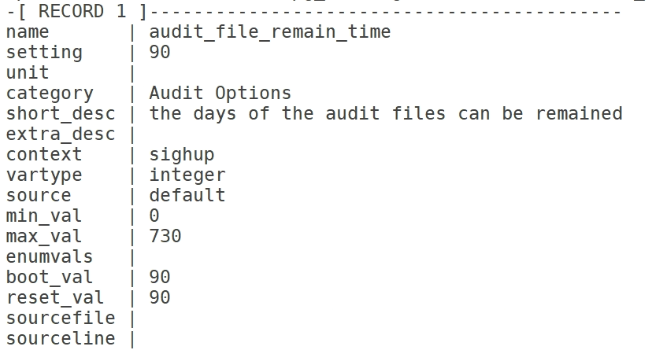
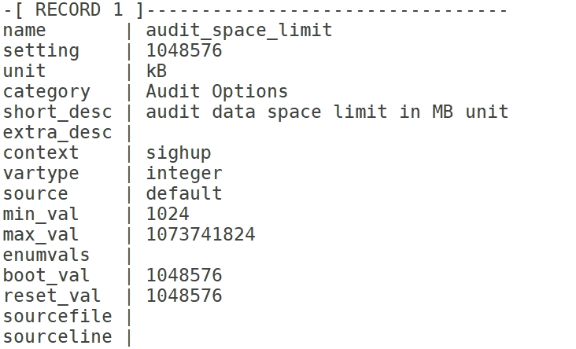
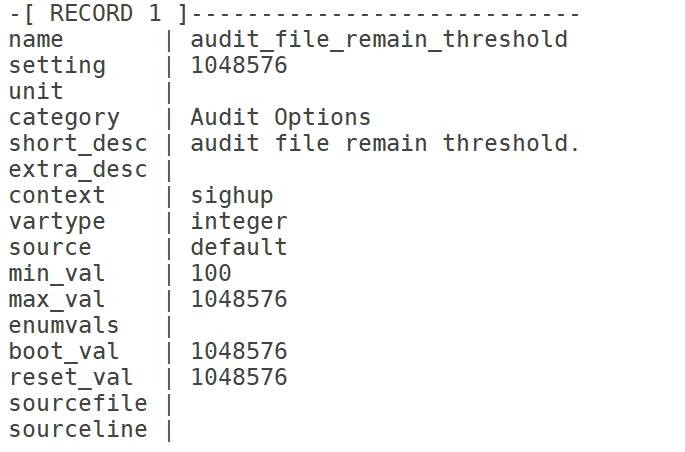

+++

title = "openGauss社区入门（openGauss-安全审计）" 

date = "2022-09-30" 

tags = ["openGauss社区开发入门"] 

archives = "2022-09" 

author = "z-qw" 

summary = "openGauss社区开发入门" 

img = "/zh/post/z-qw/title/title.jpg" 

times = "17:30" 

+++
## 审计——配置文件
配置文件中的相关参数
```
audit_enabled = on
#audit_directory = 'pg_audit'
#audit_data_format = 'binary'
#audit_rotation_interval = 1d
#audit_rotation_size = 10MB
#audit_space_limit = 1024MB
#audit_file_remain_threshold = 1048576
#audit_login_logout = 7
#audit_database_process = 1
#audit_user_locked = 1
#audit_user_violation = 0
#audit_grant_revoke = 1
#audit_system_object = 12295
#audit_dml_state = 0
#audit_dml_state_select = 0
#audit_function_exec = 0
#audit_copy_exec = 0
#audit_set_parameter = 1       # whether audit set parameter ope ration
#audit_xid_info = 0            # whether record xid info in audit log
```
## 审计开关
### 1.audit_enabled
审计进程的开启和关闭。审计进程开启后，将从管道读取后台进程写入的审计信息，并写入审计文件。
```
select * from pg_settings where name = 'audit_enabled';
```

该参数属于SIGHUP类型参数，可通下面语法修改参数关闭审计和查看审计状态：
```
alter system set audit_enabled = off;
show audit_enabled;
```
显示结果为：
```
ALTER SYSTEM SET
audit_enabled
-------------
off
(1 row)
```
参数为布尔型，默认值为on

- on表示启动审计功能。
- off表示关闭审计功能。
### 2.audit_directory
审计文件的存储目录。一个相对于数据目录data的路径，可自行指定。
```
select * from pg_settings where name = 'audit_directory';
```

该参数属于POSTMASTER类型参数<br />参数为字符串，默认值为pg_audit<br />存储文件夹

### 3.audit_data_format
审计日志文件的格式。当前仅支持二进制格式。
```
select * from pg_settings where name = 'audit_data_format';
```

该参数属于POSTMASTER类型参数<br />参数为字符串，默认值为binary
### 4.audit_rotation_interval
指定创建一个新审计日志文件的时间间隔。当现在的时间减去上次创建一个审计日志的时间超过了此参数值时，服务器将生成一个新的审计日志文件。
```
select * from pg_settings where name = 'audit_rotation_interval';
```

该参数属于SIGHUP类型参数，可进行修改
```
alter system set audit_rotation_interval = 20;
show audit_rotation_interval;
```
查看显示为
```
ALTER SYSTEM SET
audit_rotation_interval
-----------------------
20min
(1 row)
```
参数显示为整型，1~INT_MAX/60，单位为min。默认值为1d。<br />！注：请不要随意调整此参数，否侧可能会导致audit_resource_policy无法生效，如果需要控制审计日志的存储空间和时间，请使用audit_resource_policy、audit_space_limit和audit_file_remain_time参数进行控制。
### 5.audit_rotation_size
指定审计日志文件的最大容量。当审计日志消息的总量超过此参数值时，服务器将生成一个新的审计日志文件。
```
select * from pg_settings where name = 'audit_rotation_size';
```

该参数属于SIGHUP类型参数<br />参数为整型，1024~1048576，单位为KB。默认值为10MB。<br />！注：请不要随意调整此参数，否侧可能会导致audit_resource_policy无法生效，如果需要控制审计日志的存储空间和时间，请使用audit_resource_policy、audit_space_limit和audit_file_remain_time参数进行控制。
### 6.audit_resource_policy
控制审计日志的保存策略，以空间还是时间限制为优先策略。
```
select * from pg_settings where name = 'audit_resource_policy';
```

该参数属于SIGHUP类型参数<br />参数为布尔型，默认值为on

- on表示采用空间优先策略，最多存储audit_space_limit大小的日志。
- off表示采用时间优先策略，最少存储audit_file_remain_time长度时间的日志。
### 7.audit_file_remain_time
表示需记录审计日志的最短时间要求，该参数在audit_resource_policy为off时生效。
```
select * from pg_settings where name = 'audit_file_remain_time';
```

该参数属于SIGHUP类型参数<br />参数为整型，0~730，单位为day，0表示无时间限制。默认值为90。
### 8.audit_space_limit
审计文件占用的磁盘空间总量。
```
select * from pg_settings where name = 'audit_space_limit';
```

该参数属于SIGHUP类型参数。<br />参数类型为整型，1024KB~1024GB，单位为KB。默认值为1GB。
### 9.audit_file_remain_threshold
审计目录下审计文件个数的最大值。
```
select * from pg_settings where name = 'audit_file_remain_threshold';
```

该参数属于SIGHUP类型参数<br />参数为整型，1~1048576。默认值为1048576。
