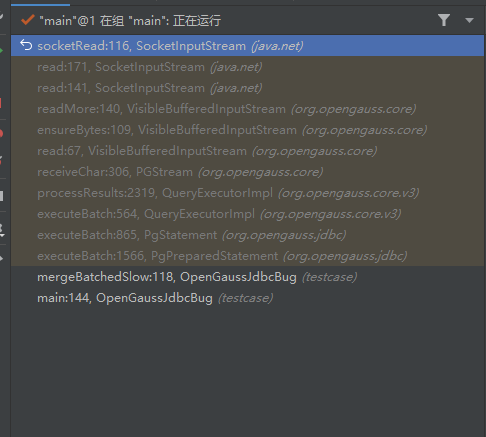
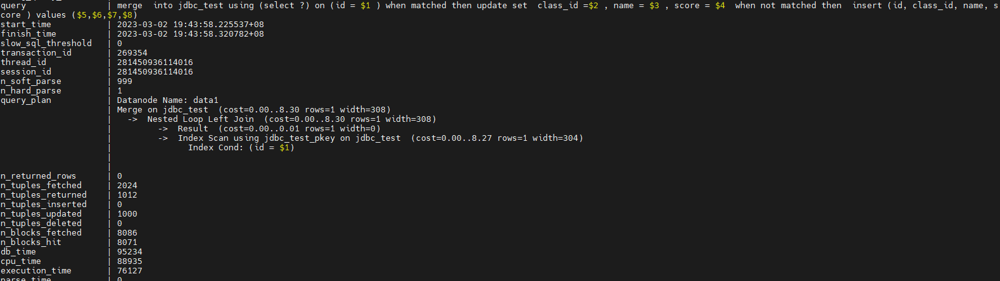
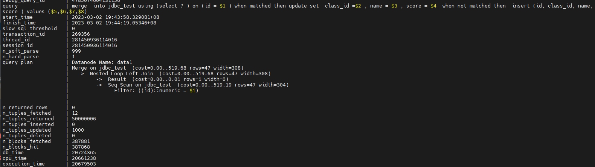

+++
title = "opengauss-jdbc问题整理"
date = "2023-02-08"
tags = ["opengauss-jdbc问题整理"]
archives = "2023-02"
author = "zhoucong"
summary = "opengauss-jdbc问题整理"
img = "/zh/post/xingchen/title/img1.png"
times = "16:00"

+++

# opengauss-jdbc问题整理(更新中)

## 问题1 jdbc批量执行insert语句时返回结果不符合Spring jpa预期

**问题描述：**

jdbc执行查询时，可以使用`preparestatment.executeBatch()`方法批量执行一组sql语句，该方法返回为`int[]`int型数组变量，含义是批量执行的每个sql语句更新的数据行数。通过spiring jpa批量执行相同格式的语句时（例如`insert into table1 values (?, ?, ? , ?)`，批量执行5次 ），预期返回的int型数组值为`[1, 1, 1, 1, 1]`，实际返回结果为`[5, 0, 0, 0, 0]`，与预期部分，导致如下报错：

```
Caused by: org.springframework.orm.jpa.JpaSystemException: Batch update returned unexpected row count from update [0]; actual row count: XX; expected: 1; nested exception is org.hibernate.jdbc.BatchedTooManyRowsAffectedException: Batch update returned unexpected row count from update [0]; actual row count: XX; expected: 1
 at org.springframework.orm.jpa.vendor.HibernateJpaDialect.convertHibernateAccessException(HibernateJpaDialect.java:331)
```

**问题原因：**

jdbc自身的优化机制，使用executeBatch批量执行sql时，如果批量执行sql格式相同，jdbc默认会将多个sql合成一个执行，所以返回结果为`[5, 0, 0, 0, 0]`。

**解决办法：**

在连接串配置`batchMode=off`，所有sql分别执行，返回结果为`[1, 1, 1, 1, 1]`。

## 问题2 数据类型不匹配时查询速度慢的问题

**问题描述：**

jdbc创建一个主键为id的表。
```
create table jdbc_test (id int primary key, class_id int, name varchar(128), score number(10,2));
```
基于如下sql构造PrepareStatement，分别使用setInt()和setBigDecimal插入主键，sql执行实现相差明显。其中使用setInt()插入主键的比较快，使用setBigDecimal()插入主键的比较慢。
```
"merge  into " + tableName + " using (select 1) on (id = ? ) when matched then update set class_id =? , name = ? , score = ? when not matched then insert (id, class_id, name, score ) values (?,?,?,?)"
```
两种sql各执行1000次的耗时对比
```
使用int创建表，并准备数据
mergeBatchedFast,mergeCount:1000,cost:100 ms
mergeBatchedSlow,mergeCount:1000,cost:20733 ms
```

**分析过程：**

抓取jdbc堆栈，发现jdbc主要卡在等待socket响应的地方，判断sql执行过慢为内核原因。



在postgresql.conf添加如下配置
```
x log_min_duration_statement = 0
track_stmt_stat_level = 'L2,L2'
```
执行`select * from dbe_perf.statement_history;`对比两个sql的查询计划。执行较快的sql的查询计划中，使用的是索引扫描。执行较慢的sql的查询计划中，使用的是全表扫描。





**问题原因：**

jdbc_test表的主键是int类型，主键数据类型与输入数据类型不一致时，会导致索引失效。merge into执行时有join操作，在查询时，执行慢的sql使用numeric类型的数据检索，导致索引失效，所以使用全表扫描，执行时间较长。执行快的sql则使用的是索引扫描，执行时间短。