         数据管理服务 （Data Admin Service，简称DAS）作为数据库工具，是连接云数据库与用户之间的桥梁，用户通过工具可以直观的体验到数据库服务的质量。

        DAS可以用来登录和操作云上数据库，是提供数据库开发、运维、智能诊断一站式云上数据库管理平台，方便用户使用和运维华为云数据库。

 **其特点有：** 

    轻松管理：实现云上可视化界面连接和管理数据库;

    高效率：实现云端研发测试，快速部署，快速访问数据库，提升研发效率;

    操作安全保障：内置了安全保护措施，有效保障数据库的稳定运行;

    可视化对象管理：导航树形结构，清晰展示各个对象并实现可视化结构管理功能;

    易操作：简单方便访问数据，SQL零基础也能无障碍进行表数据操作。

上面对于SQL零基础也能进行操作，是不是觉得很方便呀。

接下来我们基于DAS进行数据库开发管理


### 创建数据库

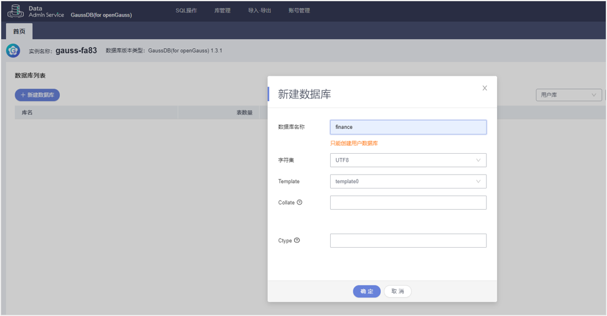

### 创建Schema


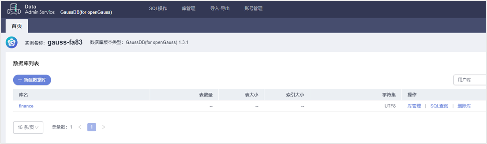
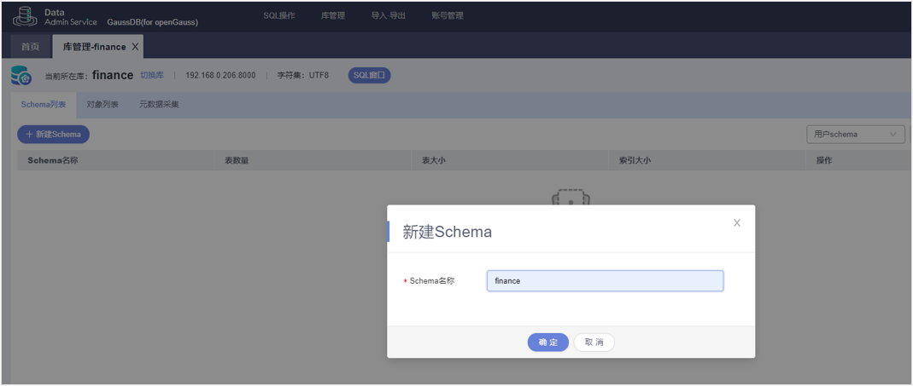
### 创建角色

    点击“账号管理”下的“角色管理”，再在角色列表页面中点击“新建角色”；
    勾选“可以登录”后，此时创建的角色具有登录权限。
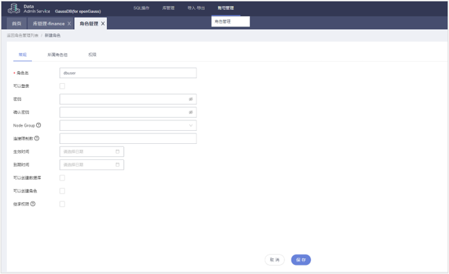
### 角色权限管理

    角色列表页面中点击相应角色操作下的“编辑”按钮，进入角色编辑页面。
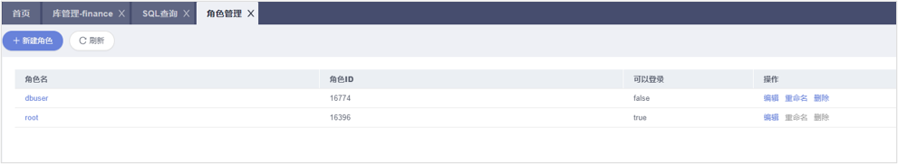
    角色编辑页面中选择“权限”，再点击添加，然后根据实际要求添加相应权限。
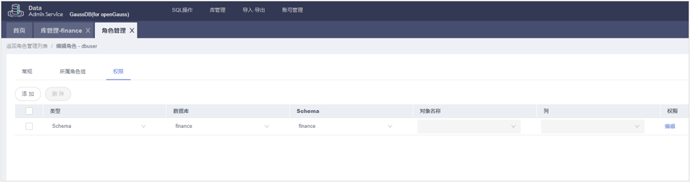
### 创建数据库用户

    在数据库的SQL查询窗口中，通过执行 CREATE USER 语句来创建用户。
例如：

```
CREATE USER dim CREATEDB PASSWORD 'Bigdata@123';
```

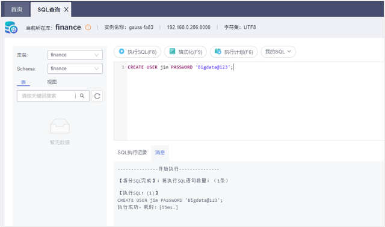
### 数据库用户管理

    在角色列表页面中点击相应角色后面的操作，可以对用户进行管理；

    点击“编辑”进入编辑页面后可以根据实际要求添加相应权限、修改用户密码等。

### 创建表

    在数据库的SQL查询窗口中，通过执行 CREATE TABLE 语句来创建表。
例如：

```
CREATE TABLE customer_t1 
( 
    c_customer_sk             integer, 
    c_customer_id             char(5), 
    c_first_name              char(6), 
    c_last_name               char(8) 
);
```

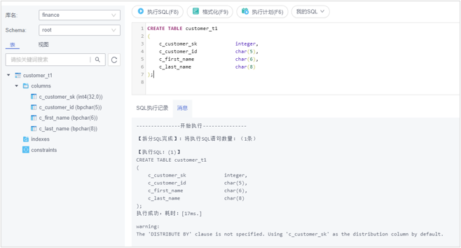
### 管理表--插入数据

    在数据库的SQL查询窗口中，通过执行 INSERT INTO 语句来往表中插入数据。

例如：


```
INSERT INTO customer_t1 VALUES (3770, 'hi', 'Lucy');
```

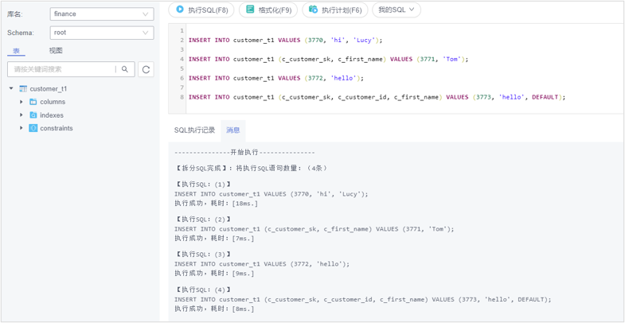

当然也支持同时插入多行数据，这里就不具体讲了。

### 管理表--查询表

    除了可以插入数据外，我们可以查询表

SELECT * FROM customer_t1;
在数据库的SQL查询窗口中，通过执行 SELECT 语句来查询表中数据。
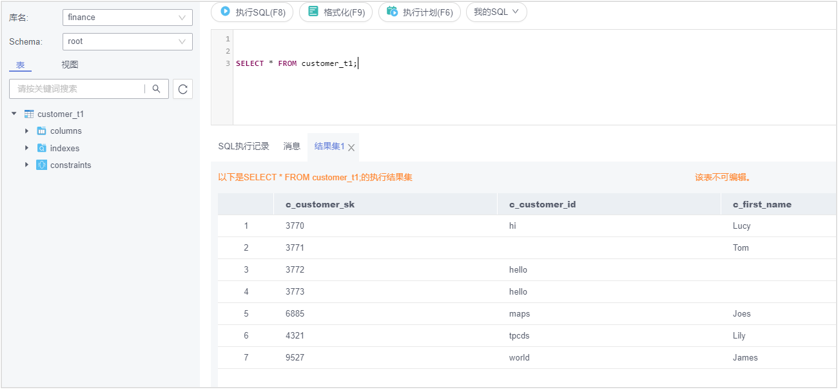
### 管理表--更新数据

    我们可以通过执行 UPDATE 语句来更新表中数据。
例如：

```
UPDATE customer_t1 SET c_first_name = 'John' WHERE c_customer_sk = 9527;
```

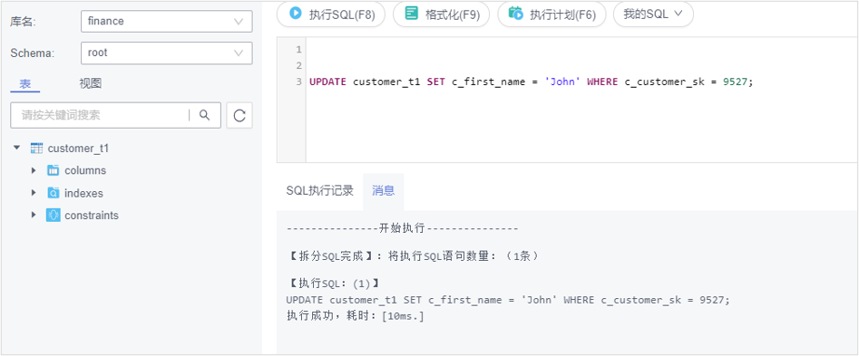
删除数据、删除表就不细述了。

### 创建临时表
  
    在数据库的SQL查询窗口中，通过执行 CREATE GLOBAL TEMPORARY TABLE 语句来创建临时表。
例如

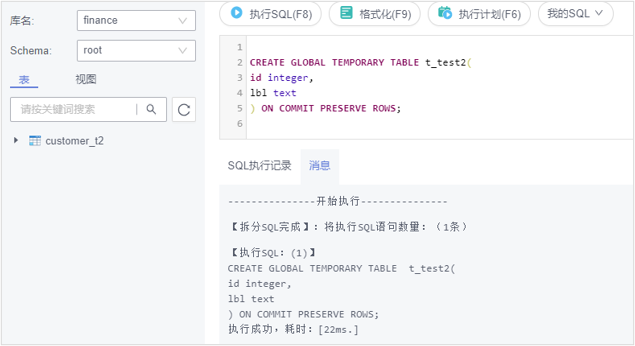
### 删除临时表

    在数据库的SQL查询窗口中，通过执行 DROP TABLE 语句来创建临时表。
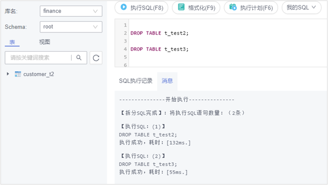


### 最后

    看了那么多了，大家快来试试吧